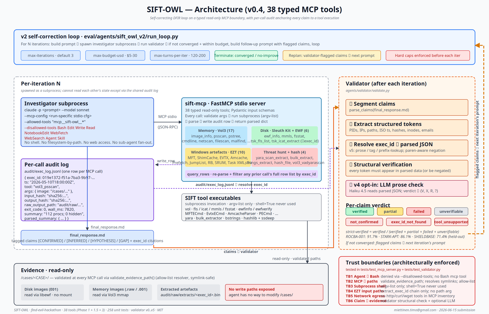

# SIFT-OWL — Autonomous DFIR Agent for SANS SIFT

> **Submission for [FIND EVIL!](https://find-evil.devpost.com/)** — SANS hackathon, Jun 15 2026.
>
> Codename: **SIFT-OWL** — *Operate, Witness, Learn*.

## Status

Active development. See [`plans/MASTER_PLAN.md`](plans/MASTER_PLAN.md) for the strategy and weekly milestones.

### What ships today

- **38 typed read-only MCP tools** over a FastMCP stdio server (`sift-mcp`). The agent connected to it has **no shell, no filesystem, no network** — it can only call the registered forensic functions.
- **Self-correcting agent loop** (`eval/agents/sift_owl_v2/run_loop.py`). The agent generates a report; a validator scores every claim against parsed tool output; the loop replans for the next iteration with the flagged claims spelled out. Terminates on convergence, no-improvement, or max-iter cap. `--llm-check` auto-enables when `ANTHROPIC_API_KEY` is in env (Haiku rescue on Unverifiable verdicts, ~$0.05/3-iter run).
- **Validator v6** — rule-based extraction (PIDs, IPs, paths, timestamps, hashes, inodes) with paren-aware negation handling, timestamp prefix matching, and an inline LLM prose-check pass (Haiku 4.5) for unverifiable prose claims. Multi-tag bullet-list paragraphs scope each trailing `(exec_id ...)` cite to its own claim (W3-52); backticked exec-ids no longer leak into the verifiable-token list (W3-50).
- **Per-call audit trail** — `audit/exec_log.jsonl` records every MCP call with `exec_id`, args, sha256 of inputs and raw output, `parsed_summary`, `wall_ms`. Every "confirmed" claim in a final report cites an `exec_id` that the validator can resolve.
- **Iterative wire-size shrink** for multi-section tools (SRUM / Amcache / persistence_keys): if the default 50-rows-per-section payload exceeds Claude's tool-result transport envelope, the truncate-fn re-runs at 25, 12, 6, 3, 1 rows/section until it fits under ~25 KB; falls back to count-only if even cap=1 is too big. Full row data stays on disk, drillable via `query_rows`.
- **Vol3 fully offline** — the bootstrap caches the community Windows symbol pack (~800 MB) under `/opt/sift-owl/vol3-symbols/`; the MCP wrapper passes it via `-s` to every `vol` call. No Microsoft Symbol Server round-trip per case; cold-start `windows.info` drops ~30 s → ~5 s on x64 images.
- **279 unit tests** + slow E2E tests. Architectural trust boundaries (TB1-TB7) have tests asserting them.

### MCP tool inventory

| Domain | Tools |
|---|---|
| **Memory (Vol3)** — 17 | `vol3_image_info`, `vol3_psscan`, `vol3_pstree`, `vol3_cmdline`, `vol3_netscan`, `vol3_filescan`, `vol3_malfind`, `vol3_svcscan`, `vol3_userassist`, `vol3_dlllist`, `vol3_handles`, `vol3_scheduled_tasks`, `vol3_hashdump`, `vol3_cachedump`, `vol3_skeleton_key_check`, `vol3_envars`, `vol3_vadyarascan` |
| **Disk (Sleuth Kit + EWF)** — 6 | `ewf_info`, `ewf_verify`, `tsk_partition_table`, `tsk_fs_stat`, `tsk_fls_list`, `tsk_icat_extract` |
| **Windows artifacts (EZ Tools + libscca + libesedb + Python)** — 10 | `ezt_mft_parse`, `ezt_shimcache_parse`, `ezt_evtx_parse`, `ezt_amcache_parse`, `ezt_prefetch_parse` (via libyal `libscca`; PECmd is Linux-broken), `ezt_jumplist_parse`, `ezt_recyclebin_parse`, `ezt_srum_parse` (via libyal `libesedb`; SrumECmd is Linux-broken), `ezt_task_xml_parse`, `ezt_persistence_keys_parse` |
| **Threat hunt + carving + hashing** — 4 | `yara_scan_extract`, `bulk_extract`, `strings_extract`, `hash_file` |
| **Drill helper** — 1 | `query_rows` (re-parse + filter any prior call's full row list by `exec_id`) |

`sift-mcp inspect` prints the inventory. EZ Tools take an `extract_exec_id` (output of a prior `tsk_icat_extract`) instead of a filesystem path — the agent has no way to point a parser at an arbitrary file.

### Headline result

| Case | Validator | Strict-verified score | Notes |
|---|---|---|---|
| ROCBA-001 single-pass v1 | v4 | 57.1% | First end-to-end run, memory-only |
| **ROCBA-001 v2 loop (iter 3)** | **v4** | **91.7%** | Convergence; rule-based + LLM prose check |
| STARK-APT-001 v1 disk+memory | v4 | 43.5% | First multi-host shakedown |
| **STARK-APT-001 v2 loop (iter 3)** | **v4** | **86.1%** | Full convergence: 0 partial, 0 failed |
| SHIELDBASE single-pass (held-out) | v5 | 71.4% | First held-out run; SrumECmd not yet on Linux |
| SHIELDBASE v2 loop, rule-only (W3-46) | v5 | 92.0% (23/25) | After libesedb-backed SRUM landed; small claim count |
| SHIELDBASE v2 loop, rule-only post wire-fit (W3-49) | v5 | 60.0% (18/30) | Variance band; agent skipped citing SRUM data |
| **SHIELDBASE v2 loop + inline `--llm-check` (W3-52)** ⭐ | **v6** | **89.9% (71/79)** | Full stack working end-to-end; 3× the substantive claim count of W3-46 |

SHIELDBASE is the SANS FOR508 / CRIMSON OSPREY case — 15+ Win10 hosts, 198 GB across memory and disk. It is the headline submission number.

## What this is

An autonomous, agentic AI forensics investigator that runs on the SANS SIFT Workstation and processes raw case data (disk images, memory captures) end-to-end without human checkpoints. It improves on the baseline [Protocol SIFT](https://github.com/teamdfir/protocol-sift) configuration along every judging axis:

| Concern | Protocol SIFT (baseline) | SIFT-OWL |
|---|---|---|
| Tool surface | `Bash(*)` allow-list with narrow deny-list | Custom MCP server exposing only typed read-only forensic functions |
| Evidence integrity | Prompt-based ("Never modify `/cases/`") | Architectural — path allow-list at MCP boundary; no shell to bypass |
| Audit trail | Single `$CONVERSATION_SUMMARY` line per session | Per-call JSONL with `exec_id`, hashes, parsed_summary |
| Hallucinations | Caught only by humans | Validator agent — every "confirmed" claim must cite an `exec_id` whose parsed output supports it |
| Context bloat | Single agent reads all raw output | MCP server parses + truncates at the wire; full rows on disk, drillable via `query_rows` |
| Self-correction | None | Persistent learning loop with validator feedback in the next iteration's prompt |



See [`docs/ARCHITECTURE.md`](docs/ARCHITECTURE.md) for the system design and trust boundaries.

## Quick start

```bash
git clone https://github.com/timietti/find-evil-hackathon.git
cd find-evil-hackathon
python3 -m venv .venv && source .venv/bin/activate
pip install -e ".[dev]"

# Inspect the MCP tool inventory (no Vol3 / evidence required)
sift-mcp inspect

# Validate the test suite passes on your machine
pytest -x --deselect tests/test_disk_e2e.py --deselect tests/test_vol3_memory_e2e.py --deselect tests/test_ez_tools_e2e.py
```

Full installation / setup: [`INSTALL.md`](INSTALL.md).

## Repo layout

```
find-evil-hackathon/
├── plans/MASTER_PLAN.md            # strategy + weekly plan
├── docs/ARCHITECTURE.md            # system design + trust boundaries
├── mcp_server/                     # custom MCP server (typed forensic functions)
│   ├── server.py                   # FastMCP stdio server
│   ├── tools/                      # memory.py, disk.py, ez_tools.py
│   ├── parsers/                    # raw tool output → structured JSON
│   └── audit.py                    # per-call JSONL writer
├── agents/
│   └── validator/                  # rule-based + LLM hallucination detector
├── eval/
│   ├── cases/                      # case.yaml + case.md per dataset
│   ├── baselines/protocol_sift/    # vanilla Claude Code baseline harness
│   ├── agents/sift_owl_v0..v2/     # SIFT-OWL eval harnesses (single-pass → loop)
│   └── results/                    # per-run validator reports + REPORT.md
├── audit/                          # default per-run audit dir (gitignored)
├── tests/                          # 173 unit tests + slow E2E
└── scripts/                        # one-off helpers
```

## License

MIT — see [LICENSE](LICENSE).
